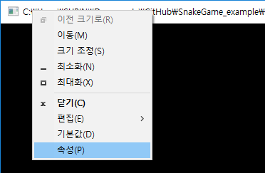
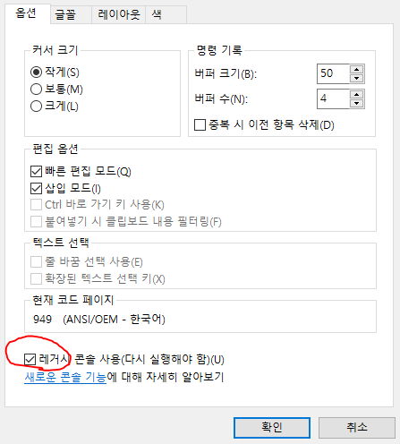

# SnakeGame
cmd 환경에서 돌아가는 게임 만들어보기 - 뱀꼬리잡기 게임

## VS기본 설정파일 다운로드
아래 링크를 마우스 오른쪽 클릭하여 '다른 이름으로 링크 저장'을 선택하면 파일을 다운로드 받을 수 있습니다.

<a href="https://raw.githubusercontent.com/CPPBeginnerStudy/SnakeGame_example/master/Exported-2018-12-08.vssettings" download="Exported-2018-12-08.vssettings">Download</a>

## 주의
Windows 10 이상인 OS에서는 콘솔 옵션에서 레거시 콘솔 사용을 체크해야 합니다.

